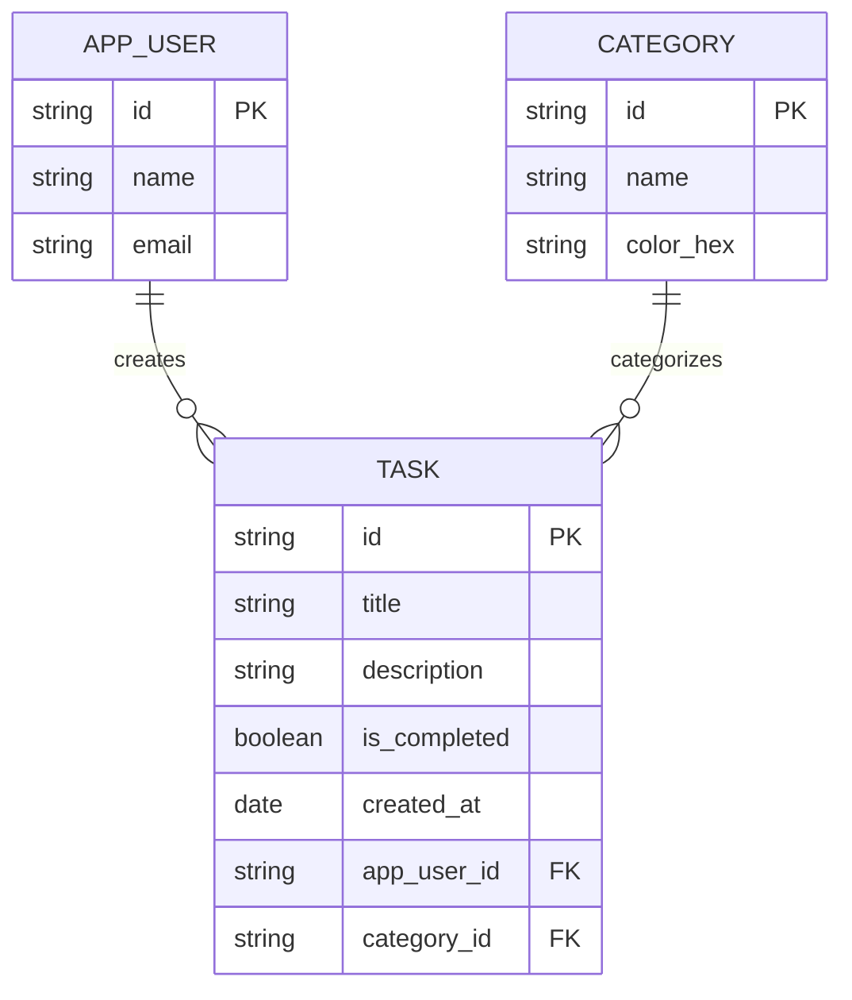

```mermaid
erDiagram
    %% ---
    %% RELATIONSHIPS DOCUMENTATION
    %% ---
    %% APP_USER to TASK: 1:N (One-to-Many)
    %% An application user can create multiple tasks over time, but each specific task belongs to exactly one user account.
    %% 
    %% CATEGORY to TASK: 1:N (One-to-Many) / One-to-Few
    %% A category can have multiple tasks associated with it, serving as a grouping mechanism. Each task belongs to one category.
    
    %% ---
    %% Core Entity: APP_USER
    %% ---
    APP_USER {
        string id PK
        string name
        string email
    }

    %% ---
    %% Core Entity: CATEGORY
    %% ---
    CATEGORY {
        string id PK
        string name
        string color_hex
    }

    %% ---
    %% Core Entity: TASK
    %% ---
    TASK {
        string id PK
        string title
        string description
        boolean is_completed
        date created_at
        string app_user_id FK
        string category_id FK
    }

    APP_USER ||--o{ TASK : "creates"
    CATEGORY ||--o{ TASK : "categorizes"
```
